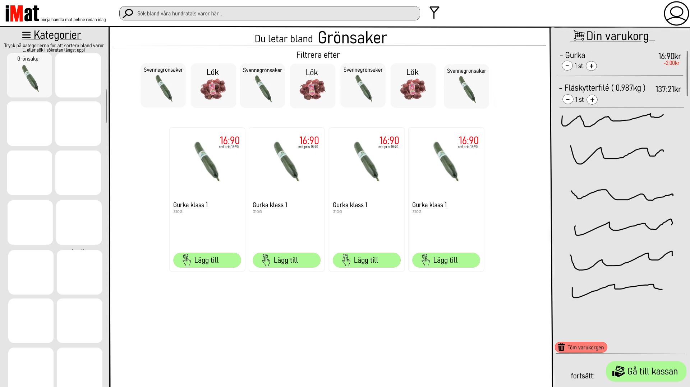

# Övningar

## Öbning 2 - Skiss

### Skisser och tankar

#### Alfreds skiss

##### Kritik från gruppen
* Känns onödigt med att förväntas hitta allt i sidomenyn till vänster.
* Lägg specifika val under sökrutan (t.ex. Pasta, Ris, Potatis).

---

##### Fördelar
* **Tydlig visuell hierarki:** Användningen av en toppmeny för huvudkategorier (Mat, Dryck, Erbjudanden) kombinerat med en sidomeny skapar en logisk struktur som är lätt att förstå vid första anblick.
* **Bekant navigationsmönster:** Designen följer ett standardmönster för e-handel (sidebar + main content), vilket minskar den kognitiva belastningen för användare som Rune och Hjördis då de känner igen sig från andra system.
* **Direkt sökbarhet:** Sökrutan är centralt placerad, vilket tillgodoser behovet hos användare som vet exakt vad de letar efter (viktigt enligt backend-specifikationen).
* **Feedback vid interaktion:** Genom att markera valda kategorier (t.ex. bocken vid "Mat" och "Kolhydrater") används principen om *statusmedvetenhet*, så att användaren alltid vet var i systemet de befinner sig.
* **Fokus på primär handling:** "Lägg i varukorg"-knappen är tydligt placerad direkt vid produkten, vilket gör det enkelt att utföra kärnuppgiften utan extra klick.

---

##### Nackdelar
* **Navigationsdjup i sidomenyn (Gruppens kritik):** Som ni påpekat kan det bli tungrott att hitta allt i sidomenyn. Om listan blir för lång krävs mycket skrollande, vilket försvårar för användare med sämre motorik eller tålamod.
* **Brist på "Breadcrumbs" eller kontext:** Om användaren klickar sig djupt ner i kategorier syns bara den sista nivån tydligt. Det saknas en tydlig väg tillbaka eller en överblick över aktiva filter.
* **Skalbarhet för personas:** För äldre användare (Rune/Hjördis) kan texten i sidomenyn upplevas som liten eller för tätt packad. Det finns en risk för "falska klick" om avståndet mellan kategorierna är för litet enligt **Fitts lag**.
* **Outnyttjat utrymme:** Den stora vita ytan till höger om "Penne" indikerar att layouten kan kännas tom innan man fyllt på med fler produkter, vilket kan göra att gränssnittet känns obalanserat.
* **Dold historik och inställningar:** Funktioner som "Mitt konto" och "Historik" (vilket är ett krav) ligger undangömda i ett hörn. För en återkommande kund kan historik vara lika viktig som sökfunktionen för att snabbt kunna handla igen.

---

##### Förbättringsförslag utifrån designmönster
* **Horisontell kategorisering (Gruppens förslag):** Lägg specifika val (Pasta, Ris, Potatis) som visuella "chips" eller knappar under sökrutan för att snabba på navigeringen och avlasta sidomenyn.
* **Implementera "Faceted Search":** Istället för en strikt trädstruktur i sidomenyn, använd filter som går att klicka i och ur för att kombinera val.
* **Igenkänning framför erinring:** För att hjälpa Rune och Hjördis, använd ikoner tillsammans med texten i sidomenyn (t.ex. en ikon av ett äpple vid "Frukt") för att underlätta snabb identifiering (*recognition over recall*).

#### Jolinas skiss

##### Kritik från gruppen
* **Bra med "Mina Favoriter":** En funktion som underlättar för återkommande kunder, även om det kräver stöd från backend.
* **Färdigbyggd varukorg:** Att ha varukorgen synlig direkt på sidan är bra för överblick (posture), men saknar specifik backend-logik i dagsläget.
* **Saknar text till ikoner:** Vissa ikoner kan vara svåra att tyda utan förklarande text.
* **Saknar profil:** Det finns ingen tydlig plats för användaruppgifter eller kontohantering.

---

##### Fördelar
* **Igenkänning framför erinring (Recognition over Recall):** Genom att använda stora bildikoner för både favoriter och kategorier hjälper designen användare som Hjördis och Rune att snabbt identifiera varor utan att behöva läsa små textlistor.
* **Transient Posture (Varukorg):** Att ha varukorgen ständigt närvarande till höger minskar antalet klick för att se totalpris och innehåll. Detta ger direkt feedback till användaren vid varje tillägg.
* **Minskad kognitiv belastning:** Layouten är luftig och fokuserar på de mest använda funktionerna (Sök, Favoriter, Kategorier), vilket gör gränssnittet mindre skrämmande för ovana användare.
* **Hantering av inköpslistor:** Skissen visar en tydlig lösning för ett av extrakraven – att kunna spara och hämta gamla listor ("Fredagsshopping"), vilket skapar stort mervärde för lojala kunder.
* **Tydlig Call-to-Action (CTA):** Knappen "Gå till betalning" är stor och tydligt separerad, vilket guidar användaren mot att slutföra köpet.

---

##### Nackdelar
* **Skalbarhet i kategorier:** Att presentera kategorier som stora knappar horisontellt fungerar bra för 4–5 stycken, men blir problematiskt om butiken har 20+ kategorier. Det kräver en lösning för skrollning eller "Visa alla".
* **Brist på filtrering:** Det saknas en tydlig struktur för hur användaren sorterar eller filtrerar varor när de väl har klickat på en kategori (t.ex. "Grönsaker"). 
* **Fitts lag & Precision:** Knapparna för att ändra antal i varukorgen (- 1 +) ser små ut. För användare med sämre finmotorik kan det vara svårt att pricka rätt utan att råka klicka på fel knapp eller papperskorgen.
* **Informationshierarki i varukorgen:** Priset för brödet (1000kr) och tomaten (6,7 kr) står med samma typsnittsstorlek. Det kan vara svårt att snabbt skanna vad som faktiskt kostar mycket i en lång lista.
* **Backend-begränsningar:** Som gruppen påpekat kräver "Favoriter" och "Inköpslistor" att backend kan identifiera användaren. Utan en tydlig "Logga in"-funktion blir dessa funktioner svåra att realisera.

---

##### Förbättringsförslag utifrån designmönster
* **Lägg till Profil-ikon:** Placera en tydlig länk till "Mitt konto" (enligt kravspecifikationen) längst upp till höger för att möjliggöra sparande av adress och betalsätt.
* **Etiketter på allt:** Säkerställ att alla ikoner (även de i varukorgen) har textetiketter för att maximera tillgängligheten.
* **Responsiv varukorg:** Fundera på om varukorgen alltid ska ta upp en tredjedel av skärmen eller om den ska gå att minimera för att ge mer plats åt sortimentet vid behov.

#### Jacobs skiss

##### Kritik från gruppen
* **Utökade cards för varor:** Bra med tydliga produktkort som innehåller både bild, text och beskrivning av varan.
* **Lätt sidovy:** Enkel och ren layout för sidonavigeringen underlättar översikten.
* **Saknar specifika kategorier:** Sidomenyn är för närvarande väldigt begränsad (Fisk, Kött, Grönsaker) och behöver expanderas för att täcka hela sortimentet.

---

##### Fördelar
* **Sovereign Posture:** Designen tar vara på hela skärmytan på ett sätt som passar en desktopapplikation där användaren förväntas spendera tid på att utforska sortimentet.
* **Direkt åtkomst till kärnfunktioner:** Knapparna för "Historik", "Kundvagn" och "Logga in" är placerade högst upp, vilket direkt adresserar tre av huvudkraven i uppgiften.
* **Standardiserade produktkort:** Genom att använda ett rutnät med kort skapas en förutsägbarhet. Användaren lär sig snabbt var "Lägg till"-knappen finns på varje vara, vilket ökar effektiviteten.
* **Sökfältets placering:** Att placera sökrutan centrerat ovanför varorna gör den till en naturlig startpunkt för användare som inte vill navigera via kategorier.
* **Tydlig köp-indikator:** Siffran (2) vid kundvagnen ger omedelbar feedback på att varor har lagts till, vilket är viktigt för användarens känsla av kontroll.

---

##### Nackdelar
* **Outnyttjat utrymme i sidomenyn:** Den vänstra kolumnen ("Vad letar du efter") har mycket tomrum. Om antalet kategorier inte ökar känns layouten obalanserad.
* **Brist på produktinformation:** På produktkorten syns "Lägg till", men det saknas prislappar och viktenhet (t.ex. kr/kg). För användare som Rune och Hjördis är priset ofta avgörande för köpbeslutet.
* **Kognitiv belastning i navigationen:** Kategorierna i sidomenyn saknar ikoner. Enbart text kan göra det svårare för äldre användare att snabbt skanna listan jämfört med om texten kombinerades med en liten symbol.
* **Otydlig logik för "Logga in":** Knappen ligger i toppmenyn, men det framgår inte hur gränssnittet förändras när man väl är inloggad (t.ex. om adressuppgifter visas).
* **Skalbarhet för produktbeskrivning:** Om beskrivningen av varan blir för lång kan korten få olika höjd, vilket skapar ett rörigt intryck (ett "Masonry"-layoutproblem) om man inte sätter fasta ramar.

---

##### Förbättringsförslag utifrån designmönster
* **Hierarkisk navigation:** Implementera en expanderbar lista i sidomenyn så att "Kött" kan öppnas upp till "Nötkött", "Fläsk", etc., för att lösa bristen på specifika kategorier.
* **Prisvisualisering:** Lägg till ett tydligt prisfält i fetstil på varje produktkort, gärna i närheten av "Lägg till"-knappen (Fitts lag).
* **Breadcrumbs (Brödsmulor):** Eftersom skissen fokuserar på kategorier, lägg till en stig ovanför produktnätet (t.ex. Hem > Mat > Fisk) så att användaren enkelt kan navigera tillbaka.
* **Status för inloggning:** Ändra "Logga in"-knappen till en profilbild eller användarnamn när man är inloggad för att bekräfta att "mina uppgifter" nu sparas, enligt kravspecifikationen.

#### Axels skiss

##### Kritik från gruppen
* **Liten text kan vara ett problem:** Särskilt under produktnamnen och i sidomenyn kan textstorleken bli en barriär för äldre användare som Rune och Hjördis.
* **Bra med varukorg till höger:** Att varukorgen alltid är synlig (persistent) skapar trygghet och ger direkt feedback på totalbeloppet.
* **Bra färgkodning:** Den gröna färgen för köpknappar och kassan ger en positiv bekräftelse och följer konventioner för "genomför handling".
* **Fixa alignments:** Det finns vissa ojämnheter i hur elementen ligger i förhållande till varandra som bör justeras för ett proffsigare intryck.

---

##### Fördelar
* **Stark Visual Framework:** Layouten känns modern och balanserad med en tydlig uppdelning mellan navigation (vänster), innehåll (mitten) och varukorg (höger).
* **Affordance i knappar:** "Lägg till"-knapparna har en tydlig ikon (handen) som signalerar klickbarhet, vilket hjälper ovana användare att förstå hur de interagerar med sidan.
* **Tydlig status (System Status):** Texten "Du letar bland Grönsaker" gör det omöjligt att gå vilse i navigeringen, vilket är en central princip för användbarhet.
* **Effektiv filtrering:** Att ha "Filtrera efter" med bilder (Svennegrönsaker, Lök) direkt under huvudrubriken gör det mycket snabbare att snäva ner sökningen än att bara använda text.
* **Prisvisning:** Användningen av röd text för "ord. pris" vid sidan av det nuvarande priset är ett bra sätt att kommunicera erbjudanden, vilket attraherar prismedvetna användare.

---

##### Nackdelar
* **Läsbarhet och kontrast:** Den ljusgrå texten på vit bakgrund (t.ex. "310G" eller instruktionstexten under Kategorier) har för låg kontrast, vilket gör den svårläst för personer med nedsatt syn.
* **Fitts lag i varukorgen:** Knapparna för plus och minus i varukorgen är relativt små och sitter tätt ihop. För Rune eller Hjördis kan detta leda till frustration om de råkar klicka på fel knapp.
* **Otydlig klick-area på kategorier:** Rutnätet till vänster för kategorier har mycket tomrum. Det är oklart om hela rutan är klickbar eller bara bilden/texten, vilket kan skapa osäkerhet.
* **Alignment och whitespace:** Som gruppen nämnde är vissa element "skeva". Exempelvis ligger "Gå till kassan" inte helt centrerad i sin sektion, och avståndet mellan produktkorten och sidomenyn är asymmetriskt.
* **Sökfältets utformning:** Sökfältet är väldigt brett men texten inuti är centrerad och ljus. Det kan vara svårt att se var man ska börja skriva.

---

##### Förbättringsförslag utifrån designmönster
* **Öka textstorlek och kontrast:** Justera all grå text till en mörkare nyans och öka basstorleken på typsnittet för att möta tillgänglighetskrav (WCAG).
* **Justera Alignments (Grid System):** Använd ett tydligt rutnät (grid) för att linjera upp överkanten på kategorimenyn med överkanten på produktdelen för att skapa visuell harmoni.
* **Visa sparade uppgifter:** Eftersom systemet ska spara adress och betalsätt, lägg till en liten indikation vid profil-ikonen längst upp till höger som visar att användaren är inloggad (t.ex. "Hej Rune!").
* **Optimera varukorgen:** Gör raderna i varukorgen något högre och knapparna (+ / -) större för att underlätta interaktion. Överväg att lägga till en tydlig "Töm varukorg"-ikon som inte riskerar att förväxlas med betalningsknappen.

# Uppgifter

## Förstudie